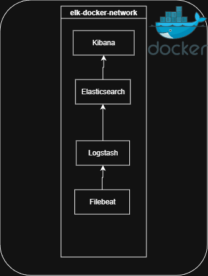

# ELK Stack – Local Lab

A self-contained **Elasticsearch + Logstash + Kibana + Filebeat** lab running
in Docker Compose.  All services use version **8.13.0** with basic security
enabled (no TLS inside the Docker network for simplicity).

---

## Directory layout

```
elk-stack/
├── docker-compose.yml          ← main orchestration file
├── .env.example                ← copy to .env and edit
├── setup.ps1                    ← one-time initialisation script
│
├── elasticsearch/              ← (no extra config needed for single-node)
│
├── logstash/
│   ├── config/logstash.yml
│   └── pipeline/logstash.conf  ← edit your pipeline here
│
├── kibana/
│   └── config/kibana.yml
│
└── filebeat/
    └── config/filebeat.yml
```

---

## Prerequisites

| Tool | Minimum version |
|------|----------------|
| Docker Engine | 24 + |
| Docker Compose v2 | 2.24 + |

### Linux – increase vm.max_map_count (required by Elasticsearch)

```bash
sudo sysctl -w vm.max_map_count=262144
# Make it permanent:
echo "vm.max_map_count=262144" | sudo tee -a /etc/sysctl.conf
```

---

## Quick start

```bash
# . Clone / copy this folder, then enter it
git clone

# 1. Create your .env file
cp .env.example .env
# Edit .env – change passwords if you like

# 3. Start the elasticsearch 
docker compose up -d elasticsearch

# 4. Run the one-time setup (sets kibana_system password)
./setup.ps1


# 5. Start the elk stack 
docker compose up -d 


# 5. Open Kibana
open http://localhost:5601
# Login: elastic / <ELASTIC_PASSWORD> from .env
# user:elastic | password:changeme
```

---

## Ports

| Service | Port | Purpose |
|---------|------|---------|
| Elasticsearch | 9200 | REST API |
| Elasticsearch | 9300 | Node transport |
| Kibana | 5601 | Web UI |
| Logstash | 5044 | Beats input |
| Logstash | 5000 | TCP JSON input |
| Logstash | 9600 | Monitoring API |

---

## Sending test data

### Via TCP (JSON)
```bash
echo '{"level":"info","message":"Hello ELK","app":"test"}' | nc localhost 5000
```

### Via curl directly to Elasticsearch
```bash
curl -X POST http://localhost:9200/my-index/_doc \
  -u elastic:changeme \
  -H "Content-Type: application/json" \
  -d '{"message":"test event","@timestamp":"'"$(date -u +%Y-%m-%dT%H:%M:%SZ)"'"}'
```

---

## Useful commands

```bash
# View live logs
docker compose logs -f

# Stop everything (data volumes preserved)
docker compose down

# Stop and DELETE all data /do not recommend only in boredom mode
docker compose down -v

# Restart a single service
docker compose restart logstash

# Check cluster health
curl -u elastic:changeme http://localhost:9200/_cluster/health?pretty
```

---

## Customising Logstash pipelines

Edit `logstash/pipeline/logstash.conf`.  The pipeline already handles:

- **Beats / Filebeat** input on port 5044  
- **TCP JSON** input on port 5000  
- **Apache/Nginx combined** access log parsing via Grok  
- **Generic JSON** message parsing  

After editing, restart Logstash:

```bash
docker compose restart logstash
```

---

## Notes

- Security is enabled but TLS is disabled inside the Docker network to keep
  the lab simple.  Do **not** expose these ports to the internet.
- The `kibana_system` password must match `KIBANA_PASSWORD` in `.env`.
  Re-run `setup.sh` if you change it.
- Heap sizes are configured via `ES_HEAP` and `LS_HEAP` in `.env`.
  For a laptop lab, 512 m / 256 m is fine.

